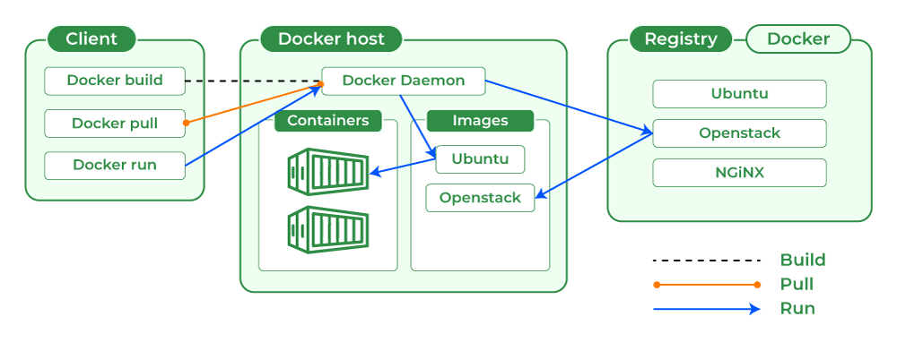

# Section 3: Popular Containerization Platforms and Docker

## **1. Popular Containerization Platforms**

Before focusing on Docker, it's good to know that Docker is **not the only tool**, but it is the **most popular and widely used**.

### 🧰 Common Containerization Tools

* **Docker** → ⭐ Most popular, industry standard
* **Podman** → Docker alternative (no daemon)
* **containerd** → Core container runtime (used internally by Docker & Kubernetes)
* **CRI-O** → Kubernetes-focused runtime

### 🧠 Important Note

Even if other tools exist, in real-world DevOps:

> 👉 **Docker is the starting point and must-know tool**

---

## **2. What is Docker?**

### 👉 Definition

> Docker is an OS‑level virtualization (or containerization) platform, that allows you to **build, package, and run applications in containers**.
> Written in the Go programming language.
> Unlike VMware (hardware‑level virtualization), Docker operates at the OS level.

---

### 🧠 In Simple Words

* Docker helps you:

  * Create containers
  * Run containers
  * Manage containers

---

### ✅ What Docker Solves

* Environment mismatch
* Slow deployments
* Dependency issues

---

## **3. Docker Architecture  and Main Components**

* Docker uses a **client–server architecture**.
* The Docker client sends requests to the Docker Daemon.
* The Docker Daemon handles container lifecycle tasks (builds, runs, and manages containers).
* Communication happens over a REST API using sockets or networks.



### 🧩 Main Components

#### **1. Docker Engin or Docker Daemon (dockerd)**

* Core engine or the brain of Docker that manages all docker objects.
* Responsible for:

  * Running containers
  * Building images
  * Managing networks & volumes

---

#### **2. Docker Client (Docker CLI)**

* The **command-line tool** that allows you to intract with **Docker Daemon**.
* The Docker Client is the primary interface for users. When you execute commands such as `docker run` or `docker build`, the client translates them into **REST API requests** and sends them to the Docker Daemon.

👉 Example:

```bash
docker run nginx
```

* This command is sent to Docker Daemon

---

#### **3. Docker Images**

> A Docker image is a **blueprint/template** used to create containers.

Docker Image is the actual **bundle or package** that Contains:

* Application code
* Dependencies
* Libraries
* Runtime

---

#### **4. Docker Containers**

> A container is a **running instance of an image**

##### Flow

```bash
Docker Image → docker run → Container
```

---

#### **5. Docker Registry**

* Centeral repository for Storing and Sharing docker images.

##### 🌐 Example

* Docker Hub (a popular public registry)

---

#### **6. Dockerfile**

* A text file that contains instructions to build docker images.
* The Dockerfile uses DSL (Domain Specific Language)

---

## **4. Docker Lifecycle (IMPORTANT)**

This shows how Docker is used in real life.

### **Step 1: Write Dockerfile**

* Define how your app will be packaged

### **Step 2: Build Image**

```bash
docker build -t myapp .
```

### **Step 3: Push Image (Optional)**

```bash
docker push myapp
```

---

### **Step 4: Pull Image**

```bash
docker pull myapp
```

---

### **Step 5: Run Container**

```bash
docker run myapp
```

---

### **Step 6: Stop / Remove Container**

```bash
docker stop <container_id>
docker rm <container_id>
```

### 🔁 Lifecycle Flow (Easy Way)

```id="k1bj7p"
Dockerfile → Image → Container → Stop/Delete
```

### 🧠 Key Insight (Very Important)

* **Dockerfile → creates Image**
* **Image → creates Container**
* **Container → runs Application**

### 🔚 Summary

* Docker is the **most widely used container platform**
* Architecture includes:

  * Daemon
  * Client
  * Images
  * Containers
  * Registry
* Lifecycle:
  * Build → Push → Pull → Run → Stop
